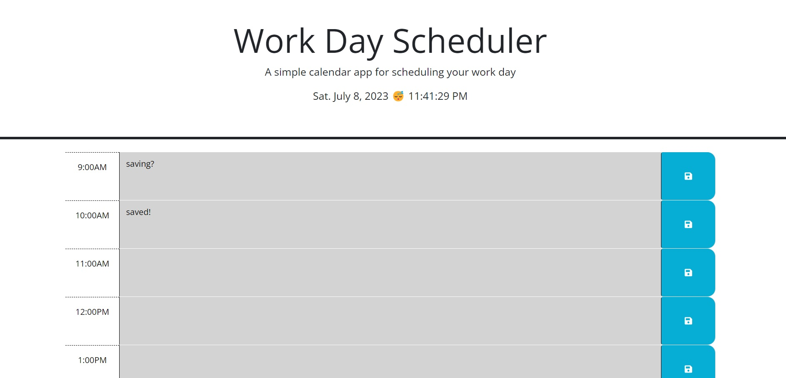
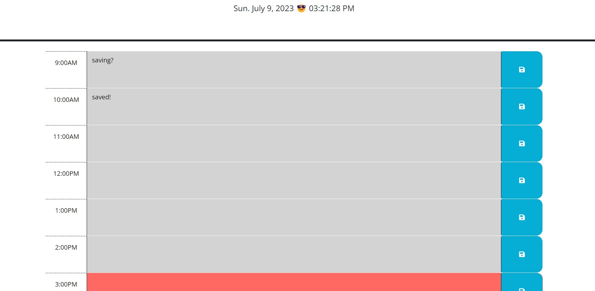

# 05 Third-Party APIs: Work Day Scheduler

This week we were tasked to create a simple calander app that allows a user to save events for each hour of a typical work day powered by jQuery. The first thing I did was to copy and paste a current div and simple changing the tags until I had enough for the full work day schedule. After I finished with the html, I began with the time and date using dayjs and added a function to show a sleep emoji if it is night time and a sunglass emoji during the day. The rest is pretty straight forward.

## User Story

AS AN employee with a busy schedule
I WANT to add important events to a daily planner
SO THAT I can manage my time effectively

## Acceptance Criteria

GIVEN I am using a daily planner to create a schedule
WHEN I open the planner
THEN the current day is displayed at the top of the calendar
WHEN I scroll down
THEN I am presented with timeblocks for standard business hours of 9am&ndash;5pm
WHEN I view the timeblocks for that day
THEN each timeblock is color coded to indicate whether it is in the past, present, or future
WHEN I click into a timeblock
THEN I can enter an event
WHEN I click the save button for that timeblock
THEN the text for that event is saved in local storage
WHEN I refresh the page
THEN the saved events persist

## Grading Requirements

**Note**: If a Challenge assignment submission is marked as “0”, it is considered incomplete and will not count towards your graduation requirements. Examples of incomplete submissions include the following:

- A repository that has no code

- A repository that includes a unique name but nothing else

- A repository that includes only a README file but nothing else

- A repository that only includes starter code

This Challenge is graded based on the following criteria:

### Technical Acceptance Criteria: 40%

- Satisfies all of the above acceptance criteria plus the following:
- Uses a date utility library to work with date and time

### Deployment: 32%

- Application deployed at live URL

- Application loads with no errors

- Application GitHub URL submitted

- GitHub repo contains application code

### Application Quality: 15%

- Application user experience is intuitive and easy to navigate

- Application user interface style is clean and polished

- Application resembles the mock-up functionality provided in the Challenge instructions

### Repository Quality: 13%

- Repository has a unique name

- Repository follows best practices for file structure and naming conventions

- Repository follows best practices for class/id naming conventions, indentation, quality comments, etc.

- Repository contains multiple descriptive commit messages

- Repository contains quality README file with description, screenshot, and link to deployed application

## App

[App](https://kenlau94.github.io/daily-structural-planner/)

## Screenshots

